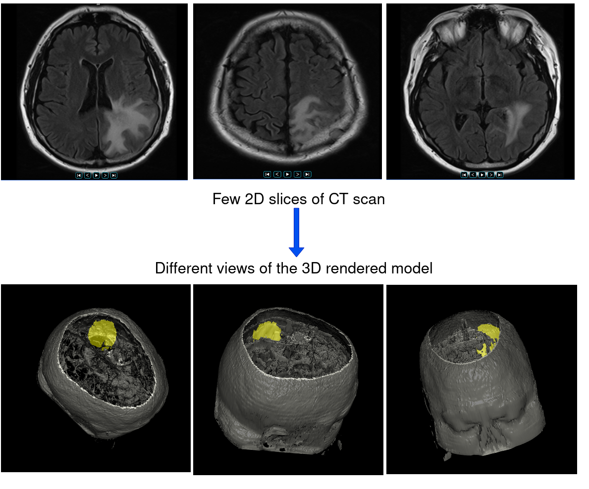

# Brain-Tumour-Visualization
2D frames of Brain CT images are converted into an interactive 3D brain model using VTK. From all the 2D slices, the tumour is segmented and saved in DICOM format. The rendered model shows the tumour region in yellow.

